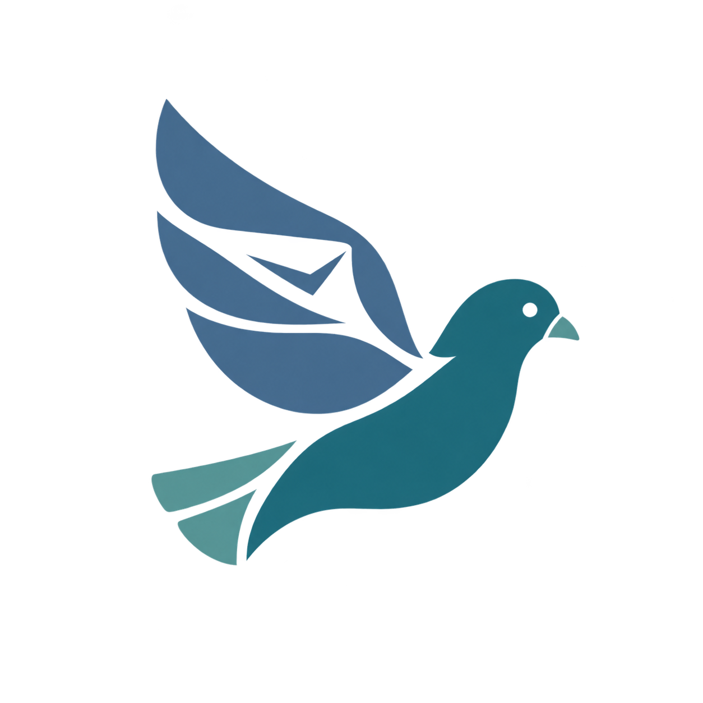

# Kaftar  

Kaftar is a Go message-delivery service with HTTP and RabbitMQ submission, scheduling, retries, and Email, SMS, Mattermost, Bale, and outbound HTTP providers. It is being migrated toward a public project; an operational console is planned but not implemented.

## Table of Contents

- [Overview](#overview)
- [Project Status](#project-status)
- [Planned Repository Layout](#planned-repository-layout)
- [Quick Start](#quick-start)
- [Documentation](#documentation)
- [Development Rules](#development-rules)
- [Migration History](#migration-history)

## Overview

The project is being rebuilt from an internal service into a maintainable public system. Its target scope includes durable message scheduling, retries, provider extensions, HTTP and queue contracts, operational visibility, and a management console.

The server and console will remain independently buildable and deployable. A separate combined image will eventually package both for installations that prefer a single container.

## Project Status

The server is migrated into `server/` and builds with **Go 1.26.5**. PostgreSQL and RabbitMQ remain required. The console and combined image are not implemented.

Source-migration task [0.1](todo/done/0.1-migrate-reference-service.md), reference-retirement task [0.1.1](todo/done/0.1.1-retire-reference-safely.md), delivery hardening task [0.1.2](todo/done/0.1.2-review-delivery-reliability.md), and provider hardening task [0.1.3](todo/done/0.1.3-harden-provider-contracts.md) are complete.

The approved [hardening design](docs/hardening-design.md) adds durable reconciliation, channel-scoped idempotency, fenced delivery claims, and stricter provider contracts. External delivery remains at-least-once, not exactly-once.

**Development use only:** the API has no authentication, and database/broker transport TLS is not configured. Do not expose it publicly. See the [migration inventory](docs/migration.md) for compatibility details and remaining gates.

Client SDKs will be implemented in independent repositories, one per language; they are not part of this server migration.

The retired reference checkout is not needed to build or run `server/`. It must not be restored inside this repository.

## Planned Repository Layout

Directories are created only when approved work requires them:

```text
server/                     Go server
server/Dockerfile           Standalone server image
console/                    Planned web console (not created)
console/Dockerfile          Planned standalone console image
deploy/combined.Dockerfile  Planned supervised combined image
docs/                       Detailed project documentation
todo/                       Ordered implementation tasks
docker-compose.yml          Local server, PostgreSQL, and RabbitMQ
```

## Quick Start

From the repository root, with Docker Engine and the Compose plugin installed:

```sh
cp server/.env.example server/.env
# Set nonempty PostgreSQL and RabbitMQ passwords in server/.env.
docker compose --env-file server/.env up --build -d --wait
curl --fail http://localhost:1404/health
```

The health endpoint returns `"Ok"`. Providers are disabled by default; configure and enable only those you need in the ignored `server/.env`. The API is bound to localhost. Use disposable development credentials for Compose, never production secrets.

```sh
go -C server test ./...
go -C server vet ./...
go -C server build -o /tmp/kaftar ./cmd
docker compose --env-file server/.env down
```

Native builds require Go 1.26.5; the test suite additionally requires a C compiler for its SQLite fixtures. See [server development](docs/development.md) for configuration and host-native startup. `down` preserves local database volumes.

## Documentation

- [Documentation index](docs/README.md)
- [Server development and configuration](docs/development.md)
- [HTTP API — OpenAPI 3.1](docs/openapi.yaml)
- [Direct queue contract](docs/queue-contract.md)
- [Provider contracts and outbound security](docs/provider-contracts.md)
- [Migration inventory and limitations](docs/migration.md)
- [Future research and delivery plan](todo/future/research-and-delivery-plan.md)
- [Task workflow](todo/AGENTS.md)

Detailed architecture, development, API, and operations documentation will be added only as the corresponding work is approved.

## Development Rules

Project-wide contribution rules are defined in [`AGENTS.md`](AGENTS.md). More specific rules may exist in semantic directories and apply together with the root rules.

Commits use English imperative [Conventional Commit](https://www.conventionalcommits.org/) messages. Behavioral changes require tests, relevant documentation updates, and recorded validation.

## Migration History

The temporary `arcaptcha-kaftar/` reference checkout has been retired. Reviewed migration evidence and compatibility decisions remain in the [migration inventory](docs/migration.md) and completed task records. Unapproved redesign research lives under [`todo/future/`](todo/future/).
